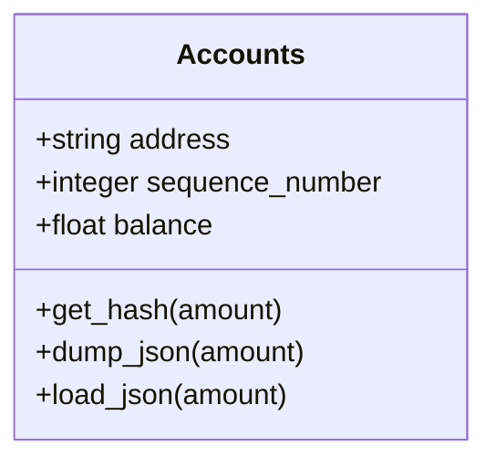
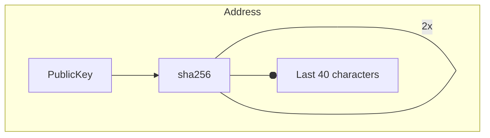

# The Accounts

The most important area of the Naruno Blockchain is Accounts. It makes the **Blockchain light**.

The core elements of an [account](https://github.com/Naruno/Naruno/blob/master/decentra_network/accounts/account.py#L19) are:

- An identifying **address**, such as 6e427f9c0e6ee1d71ea7516d5ae861da5dc9cc11. (This naruno **specific [addressing](#addressing-system)**.)
- A **sequence number**, which helps make sure any transactions this account sends are applied in the correct order and only once each. After a transaction, the sender account's sequence number increases by 1.
- An **DNC balance**. Some of this DNC is set aside for the [Reserve](#reserve).



# Address Function

Addresses allow accounts to take up less space.
The diagram below shows how the decentra network address is created from the public key.



Public key is generated by ECDSA algorithm.

This function gives the address of a public key.
You can import with this command

```python
from decentra_network.wallet.wallet import Address

public_key = "MFYwEAYHKoZIzj0CAQYFK4EEAAoDQgAEAtLa9K8MLg+frIEFBYmbYDsc0INqXedAF8SlpEGQQmOSjKV+6MxpVP53bl6elalJfCMV33WhqAelf3qkx+QHvw=="

print(Address(public_key)
```

# Reserve

Each account takes up some space in the Naruno network, so an account needs to be valuable to take up space. Reserve amount is therefore required.

- The reserve amount is currently 1000 DNC. ([Pull Request #65](https://github.com/Naruno/Naruno/commit/dead29d08e96fea738911b1cd90fe7d2d0a62c44#diff-17332442b68875a6b66bd4989c8ed80c22ce1c836445aa7042145b0c0627cf30R64))

### Changing the Reserve Amount

The reserve amount can be changed if the community accepts it in direct proportion to the price of the DNC coin.
