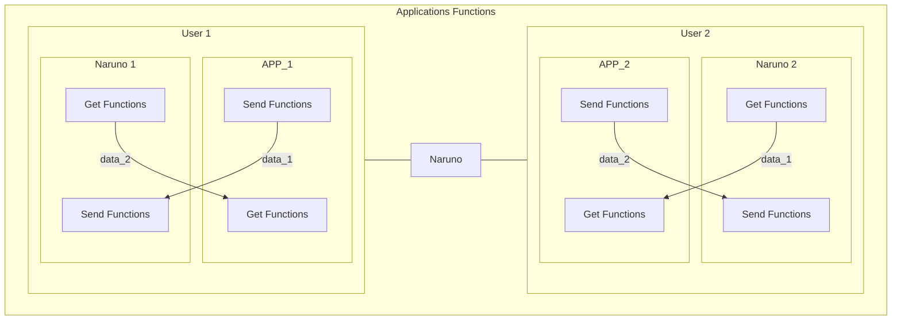
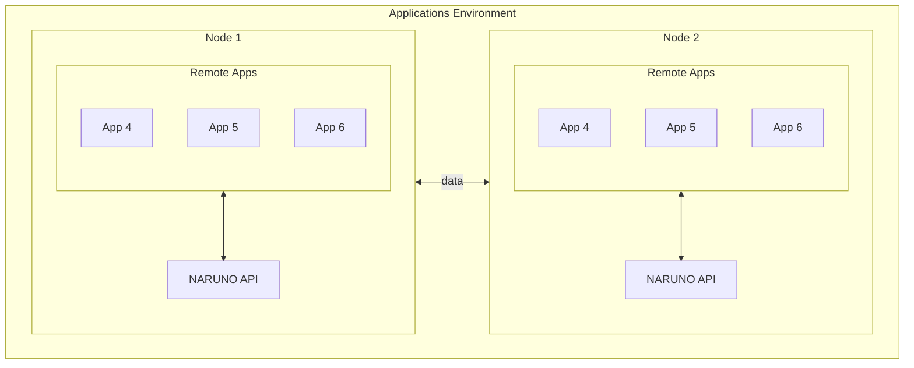

# Apps

Naruno supports the development of apps. Apps are the main way to interact with the Naruno blockchain for development decentralized applications.

For this Naruno support two integration methods. The first one is embedded apps. This apps are included in Naruno concept system. The second one is remote apps. This apps are unning outside of Naruno and uses Naruno API for communication.

For integrating apps with Naruno you need to change send and get functions with Naruno.

## Send Function

Example you have a messaging application and you want to send a message to another user. And already you have a function for sending messages. Example with socket, for integrations with Naruno just your need changing the socket with our send function. We can handle the sending message to other users.

## Get Function

In above example the user that receiving the message is have a function with socket for getting the messages. For integration with Naruno user should changing the get function with our get function. We give the messages to the user.

## Remote Apps

Remote apps are running outside of Naruno. Remote apps can uses API for sending and getting data.

