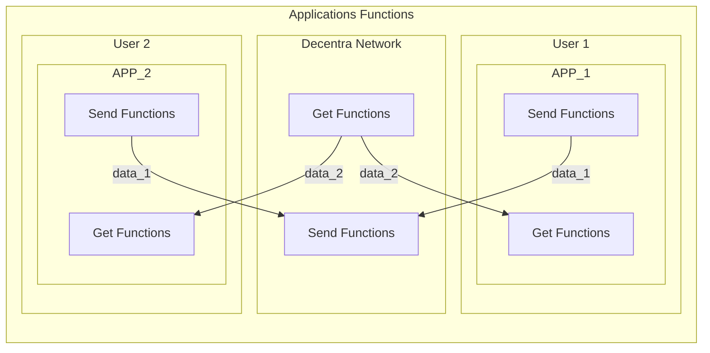
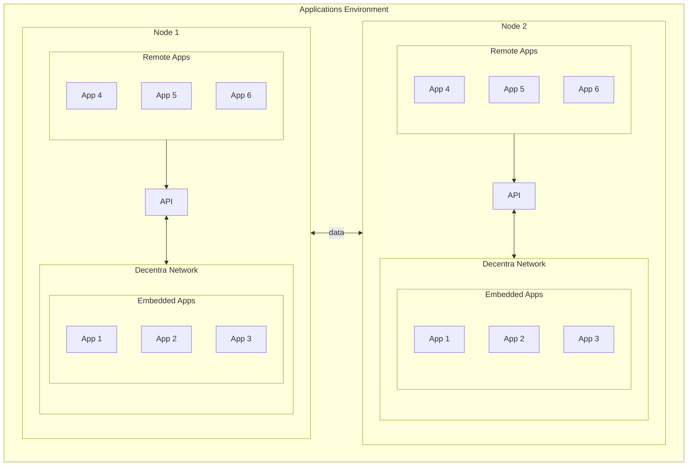

# Apps

Decentra Network supports the development of apps. Apps are the main way to interact with the Decentra Network blockchain for development decentralized applications.

For this Decentra Network support two integration methods. The first one is embedded apps. This apps are included in Decentra Network concept system. The second one is remote apps. This apps are unning outside of Decentra Network and uses Decentra Network API for communication.

For integrating apps with Decentra Network you need to change send and get functions with Decentra Network.

## Send Function

Example you have a messaging application and you want to send a message to another user. And already you have a function for sending messages. Example with socket, for integrations with Decentra Network just your need changing the socket with our send function. We can handle the sending message to other users.

## Get Function

In above example the user that receiving the message is have a function with socket for getting the messages. For integration with Decentra Network user should changing the get function with our get function. We give the messages to the user.

## Embedded Apps

Embedded apps organized by our Apps engine. Apps engine is give basic and fast integration infrastructure for decentralized apps.

When a transaction is approved by the network, if this transaction's recipient is the user of Decentra Network installation the engine is start.

If the engine finds an app send the transaction to the app. The app can process the transaction for its own purpose. For example, the app can send a notification to the user.

Also apps can uses send transactions functions for sending datas.

## Remote Apps

Remote apps are running outside of Decentra Network. Remote apps can uses API for sending and getting data.

