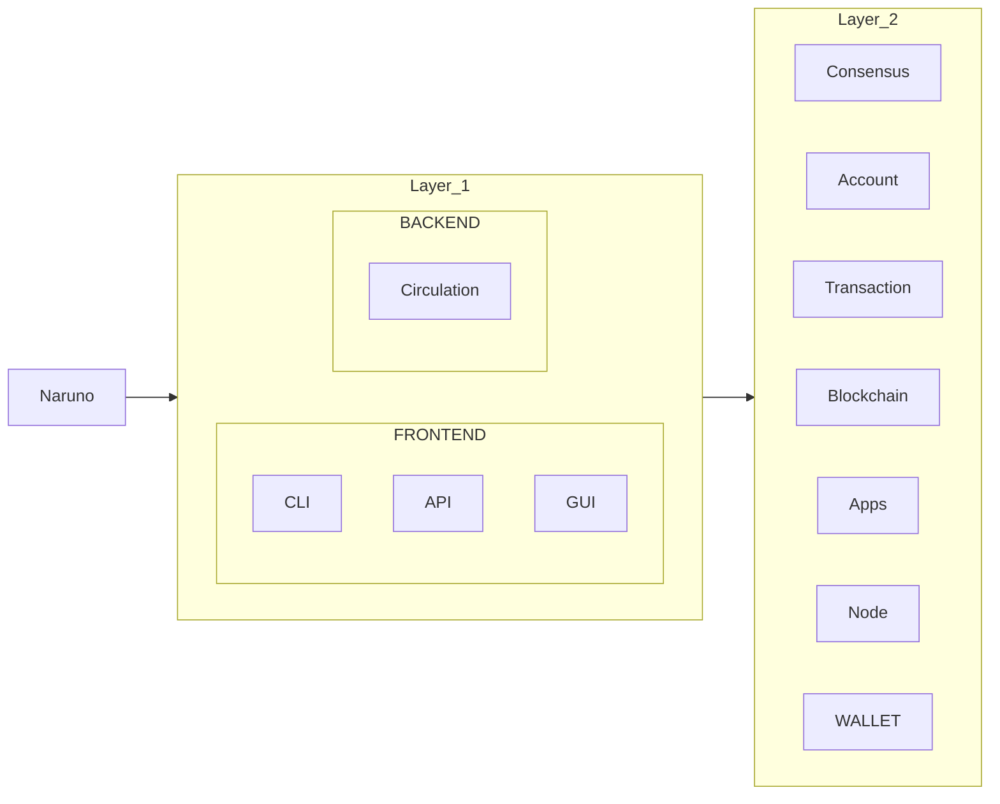

# The Architecture

The Naruno is a decentralized network of nodes that run the Naruno software. The Naruno software is a different implementation for blockchain.

We are use three layers of the Naruno architecture:

## Layer 1: Decisions

We have a frontends and backend in this layer, the fronends are the CLI, API, and GUI. The backend is the circulation. This layer is responsible for making decisions.

## Layer 2: Processing

This layer is responsible for processing the decisions made in the Layer 1. We are controlling the concept system and we are continue to blockchain in this layer.

