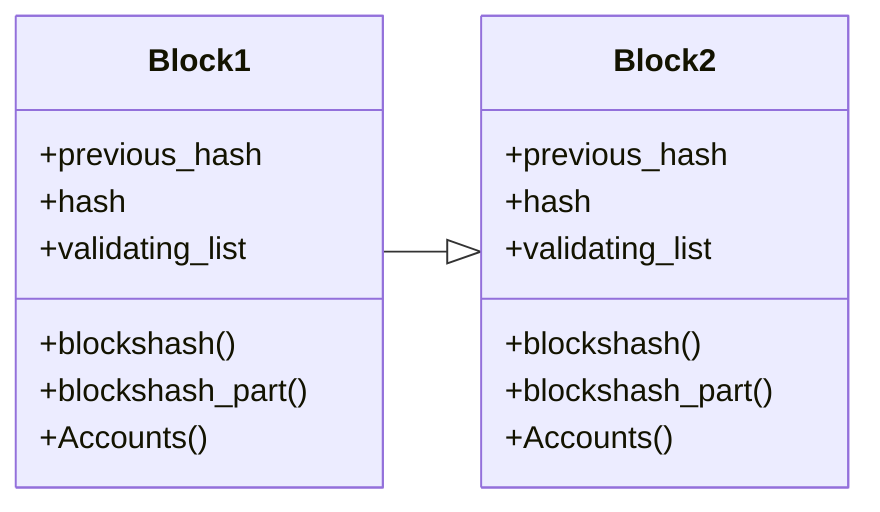
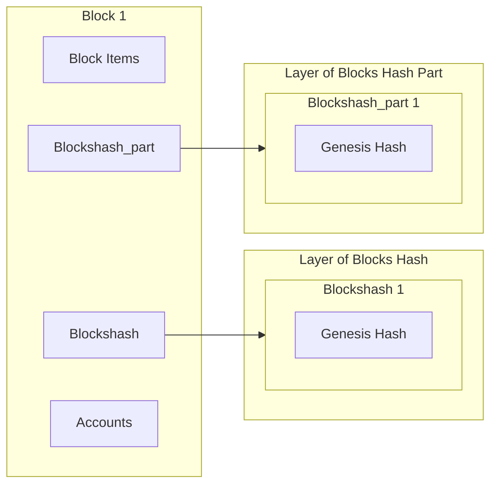
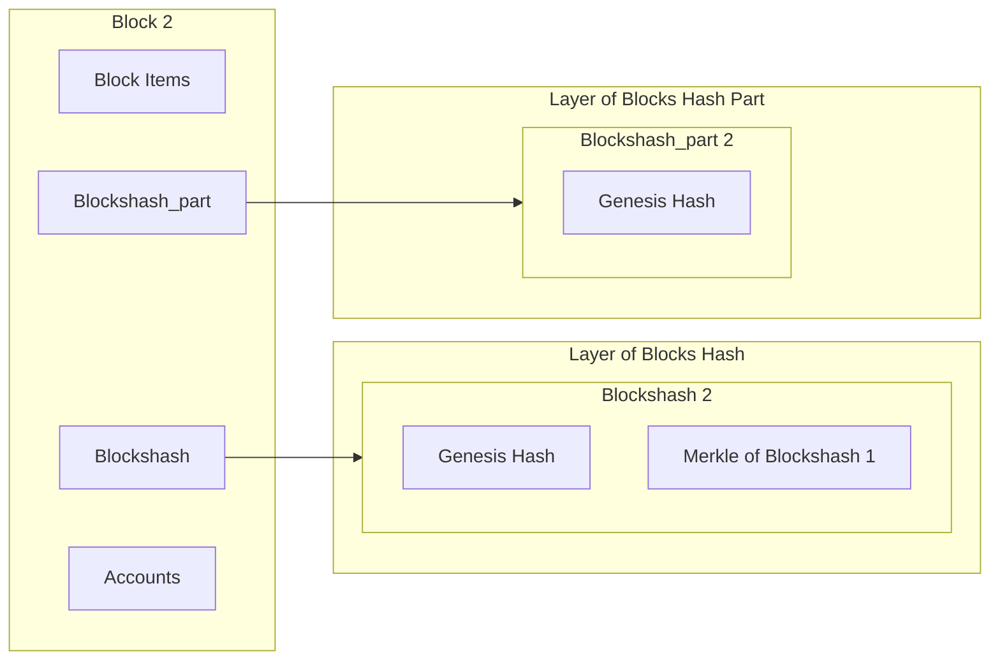
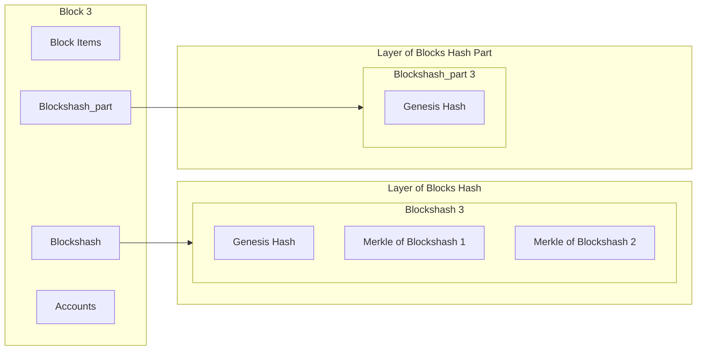
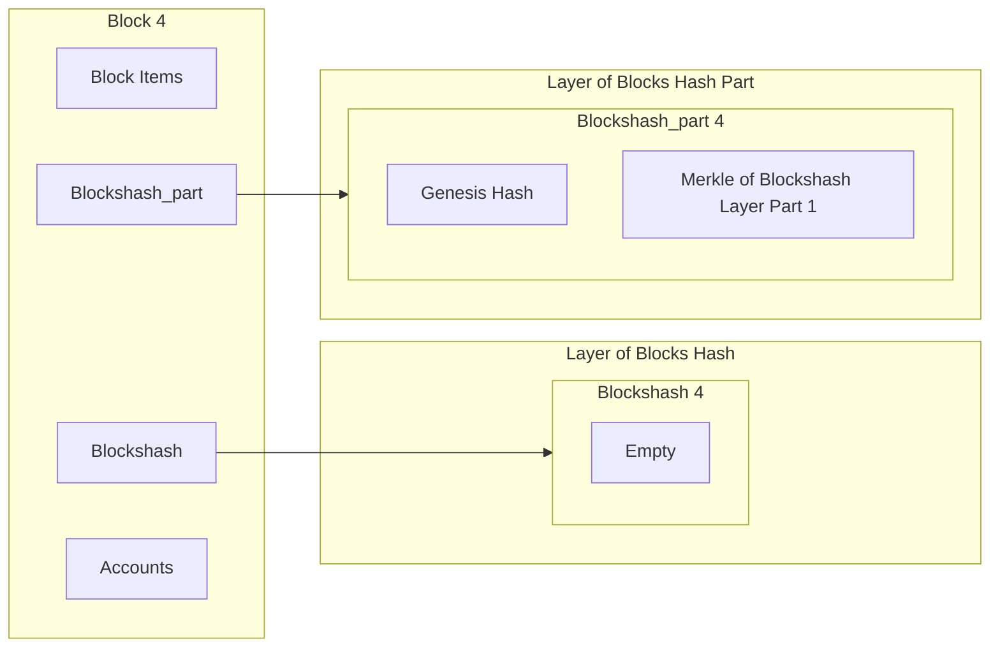
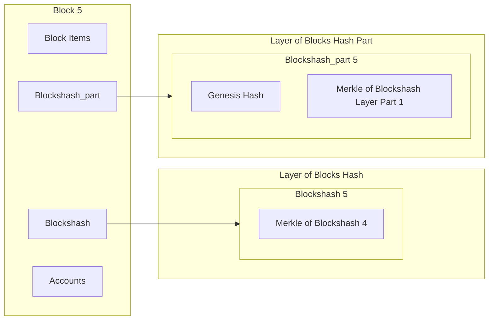

# The Blockchain

Our blockchain is seperated to `block` and `candidate_block`. The blocks are generated from `candidate_block` and this generation is running on consensus ssytem over circulation.

## Block

Block is the main part of blockchain. It contains the information of:

| location | name               | type    | Description                                     |
| -------- | ------------------ | ------- | ----------------------------------------------- |
| inside   | previous_hash      | string  | The hash of previously block                    |
| inside   | hash               | string  | This block hash                                 |
| inside   | sequence_number    | integer | This block number                               |
| inside   | empty_block_number | integer | A integer that increase with empty blocks       |
| inside   | creator            | string  | The creator of this block its take all of coins |
| inside   | coin_amount        | float   | Total coin amount                               |
| inside   | genesis_time       | integer | Genesis timestamp                               |
| inside   | start_time         | integer | This block start time                           |
| inside   | block_time         | integer | End time of this block                          |
| inside   | validating_list    | list    | Validated transactons in this block             |
| inside   | round_1_time       | integer | Sets the consensus round 1 timeout              |
| inside   | round_2_time       | integer | Sets the consensus round 2 timeout              |
| inside   | part_amount        | integer | A integer for our special system                |
| outside  | blockshash         | list    | Blocks hash list of last part_amaunt block      |
| outside  | blockshash_part    | list    | Merkle roots of every part_amount block         |
| outside  | Accounts           | list    | Returns the wallets                             |

This information is the basic for explaining the blockchain. If you want to see all information of block, you can see newest the `Block` class in [block_main.py](https://github.com/Decentra-Network/Decentra-Network/blob/master/decentra_network/blockchain/block/block_main.py)

Every blocks are a backup for our blockchain because they are have current `blockhash`, `blockshash_part` and `Accounts`. When you want to see confirmate your transaction, you need to blocks hash based history. And when we want to run entire blockchain, we need to look at the `Accounts` list.

## Block Time

Block time is stable on Decentra Network, we can calculate all blocks time with this formula:

```python
the_time = (block.genesis_time + block.block_time + ((block.sequence_number + block.empty_block_number) * block.block_time))
```

We use this because we want to set some gap blocks for new nodes syncing process. Also out consensus system must be stable about times.

## Round Time

Round time controllers is important for all of consensus system. We have two round time, first round time is for first round of consensus and second round time is for second round of consensus. These are used for consensus timeout. And can be calculated with this formula:

```python
the_round_1_end_time = block.start_time + block.round_1_time
```

```python
the_round_2_end_time = block.round_2_starting_time + block.round_2_time
```

When the time is bigger than round end time, the consensus system will be closed for the current round.

## Block Generation

In out block concepts we use some outside elements for block generation. These are about `blockshash`, `blockshash_part` and `Accounts`. These so important for block generation.

When the round 1 is complated we are calculating the block hash by all inside and outside elements. And `blockshash` and `blockshash_part` are about transaction confirmation. We are using merkle tree for this. And `Accounts` is about accounts. We are using merkle tree for this too.

In the end the blocks are looking like this:



## Saving Blocks

In Decentra Network just saving hashs of blocks and this hashed are compressed in `Block.part_amount`. With this any one must be able to save all blocks that not include transaction that be sender or receiver. And this is a best and new way for saving blocks. With our system, we are waiting for compress blocks and when the time is come, we are compressing blocks and saving them.

But there is a seperation for saving blocks. If a transaction came from us or we are the receiver of transaction, we are saving all elements of block. Also we are save the uncomressed blocks. With this we can be able to recalculate and checks for our transactions.

### Block.part_amount

In this example our part_amount is 3. Now we are running our blockchain and we are complated 3 block. With this the our new system is run for compress the blockshash layer to blockshash_part layer and lastly we are reset the blockshash layer.



As you can see the genesis hash is in blockshash and blockshash part layers. We are in block 1 and continue to block 2.



Now the blockshash layer is increase because the block 1 is commplated.



Now the blockshash layer is increase as expected. But after this operation when we switch to block 4, the blockshash layer is reset and the blockshash_part layer is increase.



After this increase we are switch the normal. Now we are incrase the blockshash layer just.



After the 5 block we are see blockshash and blockshash part layer system. With this sytem we can be able save all blocks (datas) to the future in a very small size (increase ~60mb in a year).

## Block Types

### Normal

The normal block is default and most used block. In this block we are save the blocks hash to blockshash_part list and all of other system are same as normal.

### Hard

When the blockshash part list is full, we are switch to hard block. In this block we increase the start time of block as manualy. With this increase evey participant can be able to calculate the blockshash part list. After this we are save the blockshash part list to blockshash list and reset the blockshash part list. After this we are switch to gap blocks for sync.

### Gap

This block type is for sync and came after hard block. In this block we are increase end time of block as manualy. And we are send the block to waiting sync nodes. After this we are switch to normal block.
