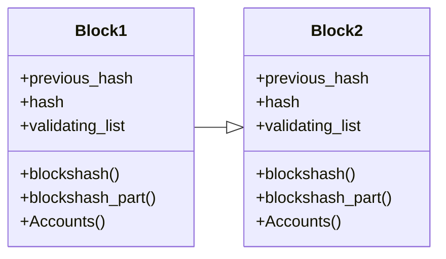

# The Blockchain
Our blockchain is seperated to `block` and  `candidate_block`. The blocks are generated from `candidate_block` and this generation is running on consensus ssytem over circulation.

## Block
Block is the main part of blockchain. It contains the information of:


| location | name                               | type                                       | Description                                       |
| ------ | ---------------------------------- | ------------------------------------------------- | ------------------------------------------------- | 
| inside    | previous_hash                      | string  | The hash of previously block        |
| inside    | hash             | string   | This block hash         |
| inside    | sequance_number           | integer | This block number     |
| inside    | empty_block_number           | integer | A integer that increase with empty blocks     |
| inside    | creator                     | string    | The creator of this block its take all of coins               |
| inside    | coin_amount                   | float       | Total coin amount                              |
| inside   | genesis_time                              | integer | Genesis timestamp                               |
| inside   | start_time                              | integer | This block start time                               |
| inside   | block_time                              | integer | End time of this block                               |
| inside   | validating_list                              | list | Validated transactons in this block                               |
| inside   | round_1_time                              | integer | Sets the consensus round 1 timeout                               |
| inside   | round_2_time                              | integer | Sets the consensus round 2 timeout                                 |
| inside   | part_amount                              | integer | A integer for our special system                            |
| outside   | blockshash                              | list | Blocks hash list of last part_amaunt block                            |
| outside   | blockshash_part                              | list | Merkle roots of every part_amount block                            |
| outside   | Accounts                              | list | Returns the wallets                               |

This information is the basic for explaining the blockchain. If you want to see all information of block, you can see newest the `Block` class in [block_main.py](https://github.com/Decentra-Network/Decentra-Network/blob/master/decentra_network/blockchain/block/block_main.py)

Every blocks are a backup for our blockchain because they are have current `blockhash`, `blockshash_part` and `Accounts`. When you want to see confirmate your transaction, you need to blocks hash based history. And when we want to run entire blockchain, we need to look at the `Accounts` list.

## Block Time
Block time is stable on Decentra Network, we can calculate all blocks time with this formula:

```python
the_time = (block.genesis_time + block.block_time + ((block.sequance_number + block.empty_block_number) * block.block_time))
```

We use this because we want to set some gap blocks for new nodes syncing process. Also out consensus system must be stable about times.

## Round Time
Round time controllers is important for all of consensus system. We have two round time, first round time is for first round of consensus and second round time is for second round of consensus. These are used for consensus timeout. And can be calculated with this formula:

```python
the_round_1_end_time = block.start_time + block.round_1_time
```
```python
the_round_2_end_time = block.round_2_starting_time + block.round_2_time
```

When the time is bigger than round end time, the consensus system will be closed for the current round.

## Block Generation
In out block concepts we use some outside elements for block generation. These are about `blockshash`, `blockshash_part` and `Accounts`. These so important for block generation.

When the round 1 is complated we are calculating the block hash by all inside and outside elements. And `blockshash` and `blockshash_part` are about transaction confirmation. We are using merkle tree for this. And `Accounts` is about accounts. We are using merkle tree for this too. 


In the end the blocks are looking like this:




