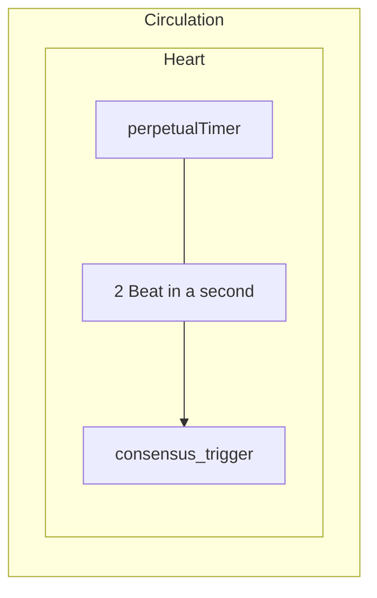

# The Circulation

Circulation system is most important and most basic part. Its just run the consensus trigger functions in every 0.50s. But its keep alive the your Naruno.

```mermaid
flowchart RL
    subgraph Circulation
        subgraph Heart
            direction TB

            perpetualTimer[perpetualTimer]
            heartbeat[2 Beat in a second]
            consensus_trigger[consensus_trigger]


            perpetualTimer --- heartbeat
            heartbeat --> consensus_trigger
        end
    end
```
