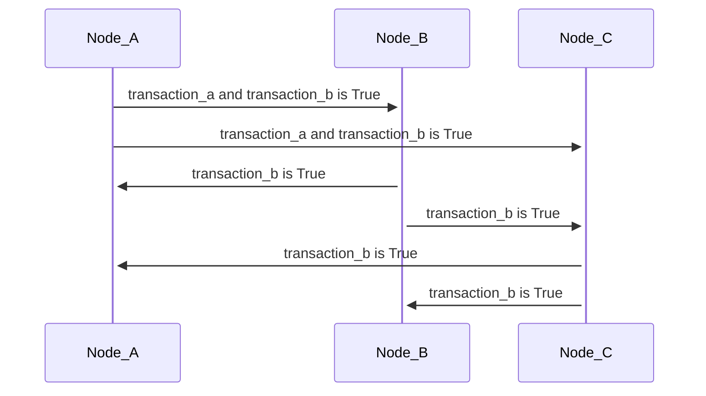
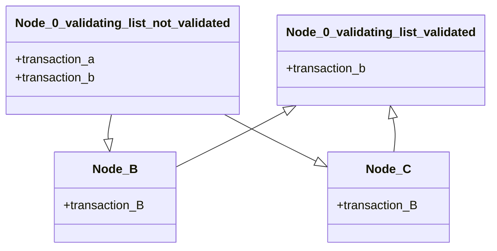
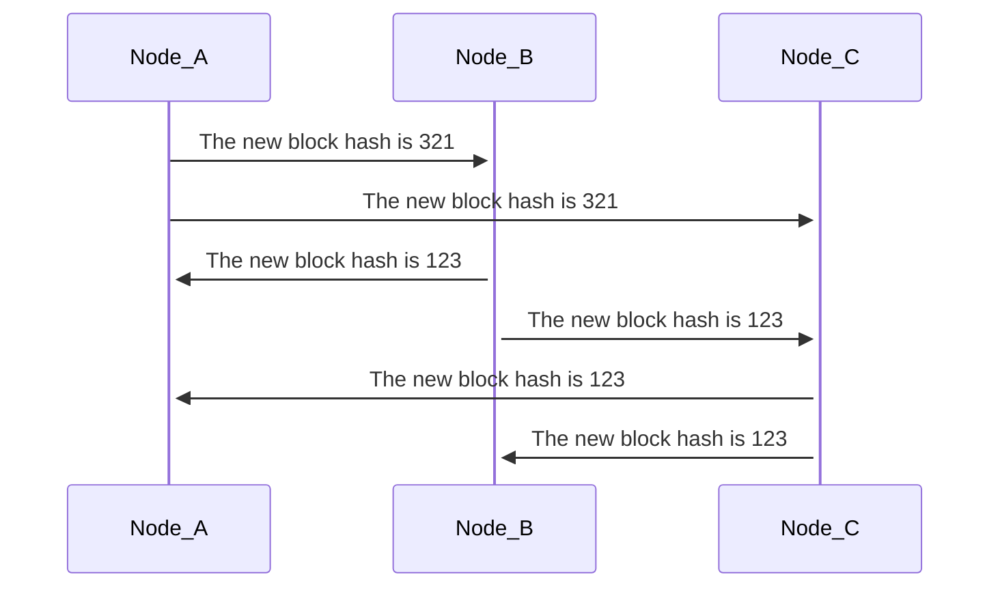
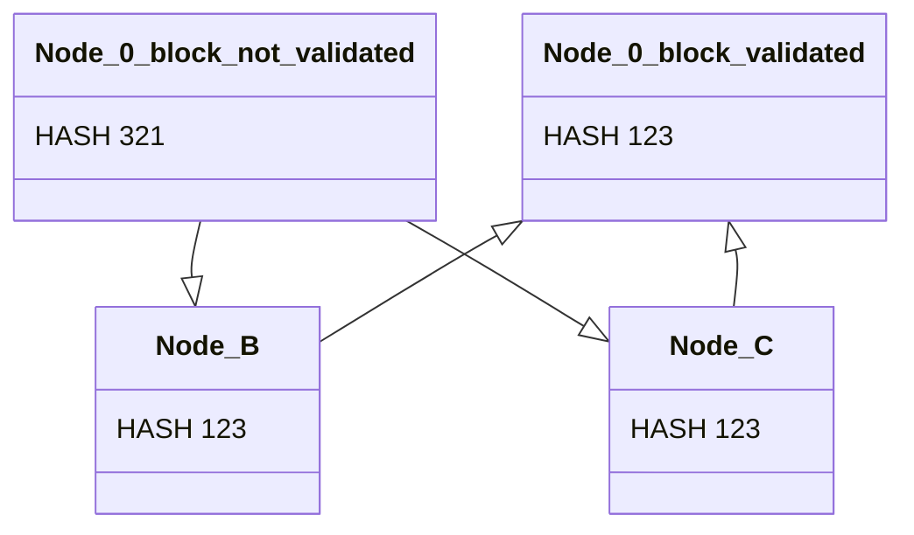
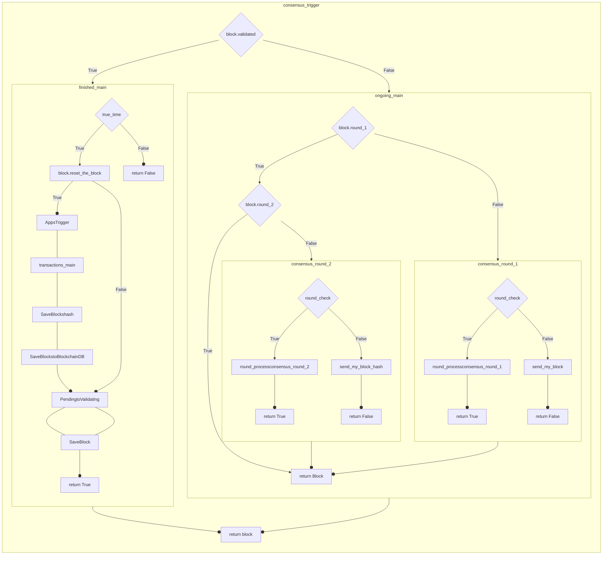

# The Consensus

Consensus is an aggrement method, if a mission on the multiple computer system needs an agreement on the same data, the consensus is the method to achieve this goal.

Blockchain is have a distributed concept, which means the data is stored on multiple computers, and the consensus is the method to achieve the agreement on the data. There is a many consensus methods, the first one is the Proof of Work. It's reach the success with hard working on the computer, think if someone wants a reward from you, you should check and control his works and if it enough you should give him the reward. This is the same as the Proof of Work, the computer that has the most work should get the reward, and the reward is from the new block. And new block is the new data that will be added to the blockchain.

The Proof of Work is a amazing start for Blockchain technology, but it's not the best method, because it's need a lot of energy and time to reach the consensus. The Proof of Work is the first method that reach the consensus, but it's not the best method, and there is a lot of other methods that can reach the consensus with less energy and time. We use the best method, The Federated Byzantine Agreement, is our consensus method.

The Federated Byzantine Agreement goal is reach success with no centralization trend, no safety risk (Preventing sybil attacks) and fast speed. FBA got his power from it's participant method. For the success on this theory, our FBA implementation that on the ongoing_main is use two stages, the first stage is the Round 1, and the second stage is Round 2.

## consensus_trigger

Consensus trigger is a starter by checking the block status if block is ready to be added to the blockchain (validated), it will add the block to the blockchain and start the finished processes. If the block is not ready, it will start consensus processes.

## finished_main

Finished main is a function that will run after the block is validated. It will check the block status for resetting if if its suitable (Have an transaction) the finished_main will save the block and run apps and transaction saver other wise function that not do these just saves and calls PendingtoValidating.

## ongoing_main

This function is run for ongoing consensus process.

- If block.round_1 is False it will run the consensus_round_1 function.
- If block.round_1 is True and block.round_2 is False its start consensus_round_2.

And return the block.

## Round 1

The first stage of consensus will sync the transaction that selected as True from majority. For this every node send self candidate block that include suggested transactions.

When a node got enough candidate block (Majority of UNL Nodes) the proccessing is starts and transaction process and the transaction that selected from majority will be added to the block. After the transaction process is done, the new block is created and ready to round 2.

### Comunication

Every node send self block to the network and the network send the block to the other nodes.

These process runs in the

- 'naruno.node.server.server.send_my_block'
- 'naruno.node.server.server.get_candidate_block'

functions.

### Decision

When a node got enough candidate block (Majority of UNL Nodes) it's run a decision mechanism with this:

- 'naruno.consensus.rounds.round_1.process.transactions.transactions_main.transactions_main'

function.

## Round 2

The last stage of consensus is the round 2, in this stage the block hash that created in the round 1 will be validated by the nodes. The nodes send self block hash to UNL nodes. When the block got enough validation result (80% same of UNL Nodes) the block will be added to the blockchain as a validated block.

### Comunication

In this stage every node send self block hash to other UNL nodes with this

- 'naruno.node.server.server.send_my_block_hash''
- 'naruno.node.server.server.get_candidate_block_hash'

functions.

### Decision

When a node got enough candidate block hash (Majority of UNL Nodes) it's run a decision mechanism with this:

- 'naruno.consensus.rounds.round_2.process.candidate_blocks_hashes.candidate_blocks_hashes_main.process_candidate_blocks_hashes'

function.

## Consensus Diagram

This diagram includes main process except some endpoint functions contents.

