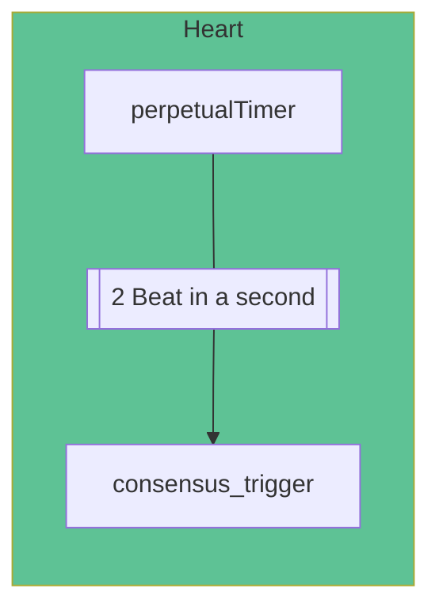

# The Consensus

Consensus is an aggrement method, if a mission on the multiple computer system needs an agreement on the same data, the consensus is the method to achieve this goal.

Blockchain is have a distributed concept, which means the data is stored on multiple computers, and the consensus is the method to achieve the agreement on the data. There is a many consensus methods, the first one is the Proof of Work. It's reach the success with hard working on the computer, think if someone wants a reward from you, you should check and control his works and if it enough you should give him the reward. This is the same as the Proof of Work, the computer that has the most work should get the reward, and the reward is from the new block. And new block is the new data that will be added to the blockchain.

The Proof of Work is a amazing start for Blockchain technology, but it's not the best method, because it's need a lot of energy and time to reach the consensus. The Proof of Work is the first method that reach the consensus, but it's not the best method, and there is a lot of other methods that can reach the consensus with less energy and time. We use the best method, The Federated Byzantine Agreement, is our consensus method.

## Federated Byzantine Agreement (FBA)
The Federated Byzantine Agreement goal is reach success with no centralization trend, no safety risk (Preventing sybil attacks) and fast speed. FBA got power from it's participant method. For the success on this theory, our FBA implementation is use two stages, the first stage is the Pre-Consensus (Round 1), and the second stage is the Consensus (Round 2). And we use Heart to  run this two stages.

# Decentra Network Consensus
## Heart
The Heart is most important part, it's run the stages after a decision.

Heart beat in two times in a second and runs the 'decentra_network.consensus.consensus_main.consensus_trigger' functions

