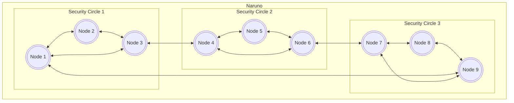

# The Node

Node are the hard working concepts of Naruno, every data is sending and getting via Node. The nodes are have a checking process before connections. This is ip, port and ID. If the node that try to connect have an similar node and port settings Node is not accept this requests. Also we have a mechanism for checking the IDs named as Unique Node List UNL.

## Unique Node List (UNL)

This is a unique trusted node lists for every node. If you want to add a node to your node you must be added it's ID to UNL list. Otherwise your node will not accept the node that you want to add.

## Security Circle

Security circle is an important concept for Naruno. This is a circle that consisting of nodes. When a group node example Node 1, Node 2 and Node 3 trusted each other they are be security circle. This is a circle that can be used for sending and getting datas to each other and process the consensus.

## Syncing

When you want to syncing from an node in Naruno, the node will include your node to sync wait list. When the Gap blocks are camed the node will send the block to your node. This syncing is very fast because the blocks are verry small and you just need last block.
