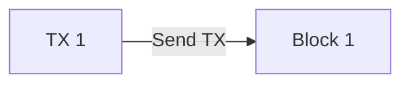
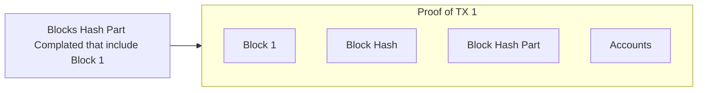
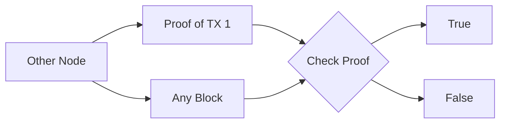

# The Proofs

Naruno have a system and mindset for proof. If you sende a transaction to the network, the network must be process your request and finish the consensus. But there is a important thing, the block and other materials to calculate hash of the block just saved from sender (you) and receiver. Others does not save your data, just process.

But what happen if i want to get proof of my data (transaction in other word) For this we have a system with saving from sender (you) and receiver system. This is parting system. With this your node (sender) and receiver node will be saved the block and other materials to calculate part of blockshash with this items the other nodes that not saved yours block and materials can be able to check your proof.

When you send a transaction to the network your node will be add to current block.

And after adding your node will be waiting for complating part_amount that include block that your transaction added to.

With this operation you have a proof and now you can share any node this proof and they can check easily.

