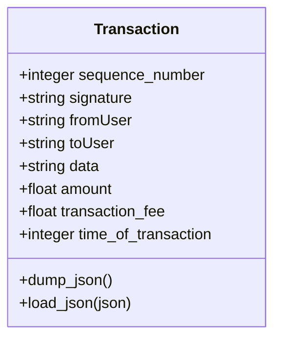
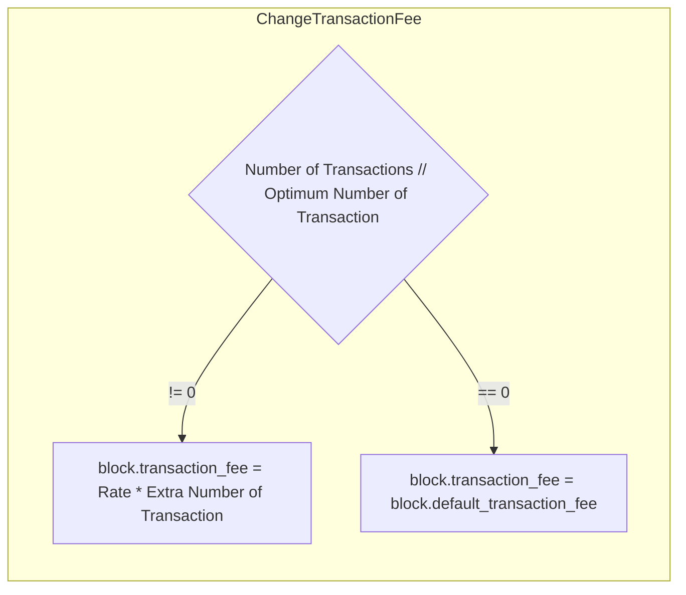

# The Transactions

Transactions are the mainstay of every operation on the network. If the transaction is correct, it will be accepted.
Pseudo transactions are not accepted and will not propagated through the network.

The core elements of an [transaction](https://github.com/Naruno/Naruno/blob/master/naruno/transactions/transaction.py#L13) are:

- A number from the account class that ensures that
  each transaction is valid once.
- A signature proving that the sender approved the transaction.
- Sender's public key.
- Receiver's address.
- A text that can be written into the transaction.
- A int or float amount to be sent.
- Fee for transaction.
- time: Sending time.

## Minumum Transaction Amount

In Naruno the accounts need to have a DNC for including in the network. With this if the receiver account does not have a DNC, you must send a minimum amount of DNC to the receiver account. Otherwise, you can use transactions amount as 0. But in all situations, you must send a transaction fee.

# Dynamic Transaction Fee System

Transaction fees are determined by a special mechanism, and must be charged at a fee that the majority of the network can accept, sometimes the network may not accept the standard transaction fee.

- Each node sets an optimum transaction amount for itself
- Currently default optimum transaction amount 10 ([Pull Request #66](https://github.com/Naruno/Naruno/commit/82e124919e8031fed1a784bf5ddb023febb8a587#diff-17332442b68875a6b66bd4989c8ed80c22ce1c836445aa7042145b0c0627cf30R62))

